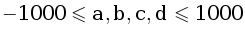

   

      <h1 class="title">C. Корень кубического уравнения</h1>
      <table>
         <tr class="time-limit">
            <td class="property-title">Ограничение времени</td>
            <td>1&nbsp;секунда</td>
         </tr>
         <tr class="memory-limit">
            <td class="property-title">Ограничение памяти</td>
            <td>64Mb</td>
         </tr>
         <tr class="input-file">
            <td class="property-title">Ввод</td>
            <td colspan="1">cubroot.in</td>
         </tr>
         <tr class="output-file">
            <td class="property-title">Вывод</td>
            <td colspan="1">cubroot.out</td>
         </tr>
      </table>
   

   <h2></h2>
   

         
Дано кубическое уравнение ax3+bx2+cx+d=0 (a&ne;0). Известно, что у этого уравнения есть ровно один корень. Требуется его найти.
         

   <h2>Формат ввода</h2>
   

         
Во входном файле через пробел записаны четыре целых числа: .
         

   <h2>Формат вывода</h2>
   

         
Выведите единственный корень уравнения с точностью не менее 5 знаков после десятичной точки.

   <h3>Пример 1</h3>
   <table class="sample-tests">
      <thead>
         <tr>
            <th>Ввод</th>
            <th>Вывод</th>
         </tr>
      </thead>
      <tbody>
         <tr>
            <td><pre>1 -3 3 -1
</pre></td>
            <td><pre>1.0000036491
</pre></td>
         </tr>
      </tbody>
   </table>
   <h3>Пример 2</h3>
   <table class="sample-tests">
      <thead>
         <tr>
            <th>Ввод</th>
            <th>Вывод</th>
         </tr>
      </thead>
      <tbody>
         <tr>
            <td><pre>-1 -6 -12 -7
</pre></td>
            <td><pre>-1.0000000111
</pre></td>
         </tr>
      </tbody>
   </table>

