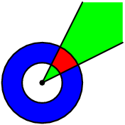

   

      <h1 class="title">E. Полярные прямоугольники</h1>
      <table>
         <tr class="time-limit">
            <td class="property-title">Ограничение времени</td>
            <td>5&nbsp;секунд</td>
         </tr>
         <tr class="memory-limit">
            <td class="property-title">Ограничение памяти</td>
            <td>64Mb</td>
         </tr>
         <tr class="input-file">
            <td class="property-title">Ввод</td>
            <td colspan="1">стандартный ввод или input.txt</td>
         </tr>
         <tr class="output-file">
            <td class="property-title">Вывод</td>
            <td colspan="1">стандартный вывод или output.txt</td>
         </tr>
      </table>
   

   <h2></h2>
   

         
Вася недавно изучил полярную систему координат. А именно, он изучил понятие полярного прямоугольника. Пусть задана стандартная
            декартова плоскость. Если на ней нарисовать две окружности с центром в начале координат, то область, находящаяся между ними,
            называется кольцом (на рисунке обозначена синим). Если на ней нарисовать два луча, то область, заметаемая первым лучом при
            движении ко второму, называется углом (т.е. область между этими двумя лучами, на рисунке обозначена зеленым). Полярным прямоугольником
            называется пересечение некоторого угла с некоторым кольцом (на рисунке обозначено красным).
         

      
Задано несколько полярных прямоугольников. Найдите площадь их пересечения. Помните, что пересечение полярных прямоугольников
         может состоять из нескольких частей!
      

   

   <h2>Формат ввода</h2>
   

         
В первой строке вводится целое число N — количество прямоугольников (1 ≤ N ≤ 100 000). Далее в N строках содержится описание
            прямоугольников. Каждый прямоугольник описывается четверкой действительных чисел r1, r2, φ1, φ2, где r1, r2 обозначают радиусы окружностей, образующих кольцо (r1 &lt; r2), а φ1, φ2 обозначают углы, образованные первым и вторым лучами с осью абсцисс, заданные в радианах. При этом заметается область от
            первого луча до второго в направлении против часовой стрелки (т.е. возрастания углов), даже в случае, когда φ1 &gt; φ2. Все числа заданы максимум с шестью знаками после десятичной точки. Углы лежат в полуинтервале [0, 2π), а радиусы не превосходят
            106. Гарантируется, что φ1 ≠ φ2.
         

   <h2>Формат вывода</h2>
   

         
Выведите единственное число — площадь искомого пересечения. Ответ будет считаться правильным, если его абсолютная или относительная
            погрешность не будет превышать 10-6.
         

   

   <h3>Пример 1</h3>
   <table class="sample-tests">
      <thead>
         <tr>
            <th>Ввод</th>
            <th>Вывод</th>
         </tr>
      </thead>
      <tbody>
         <tr>
            <td><pre>2
1 3 0 3
2 4 1.5 4.5
</pre></td>
            <td><pre>3.7500000000
</pre></td>
         </tr>
      </tbody>
   </table>
   <h3>Пример 2</h3>
   <table class="sample-tests">
      <thead>
         <tr>
            <th>Ввод</th>
            <th>Вывод</th>
         </tr>
      </thead>
      <tbody>
         <tr>
            <td><pre>2
1 2 0 3
1 2 2 1
</pre></td>
            <td><pre>3.0000000000
</pre></td>
         </tr>
      </tbody>
   </table>

