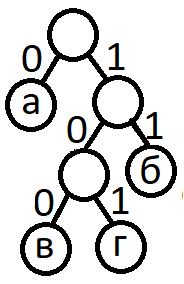

   

      <h1 class="title">E. Дерево Хаффмана</h1>
      <table>
         <tr class="time-limit">
            <td class="property-title">Ограничение времени</td>
            <td>1&nbsp;секунда</td>
         </tr>
         <tr class="memory-limit">
            <td class="property-title">Ограничение памяти</td>
            <td>64Mb</td>
         </tr>
         <tr class="input-file">
            <td class="property-title">Ввод</td>
            <td colspan="1">стандартный ввод или input.txt</td>
         </tr>
         <tr class="output-file">
            <td class="property-title">Вывод</td>
            <td colspan="1">стандартный вывод или output.txt</td>
         </tr>
      </table>
   

   <h2></h2>
   

         
Алгоритм Хаффмана позволяет кодировать символы алфавита беспрефиксным кодом различной длины, сопоставляя частым символам более
            короткий код, а редким - более длинный. Этот алгоритм используется во многих программах сжатия данных. Код символа определяется
            по следующим правилам:
         

1. Символы входного алфавита образуют список свободных узлов. Каждый лист имеет вес, который может быть равен либо вероятности,
         либо количеству вхождений символа в сжимаемое сообщение.
      

      
2. Выбираются два свободных узла дерева с наименьшими весами.

      
3. Создается их родитель с весом, равным их суммарному весу.

      
4. Родитель добавляется в список свободных узлов, а два его потомка удаляются из этого списка.

      
5. Правой дуге, выходящей из родителя, ставится в соответствие бит 1, левой - бит 0. Битовые значения ветвей, исходящих от
         корня, не зависят от весов потомков.
      

      
6. Шаги, начиная со второго, повторяются до тех пор, пока в списке свободных узлов не останется только один свободный узел.
         Он и будет считаться корнем дерева.
      

      
Пусть буквы "а" встречается в сообщении 4 раза, буква "б" - 3 раза, а буквы "в" и "г" - по 1 разу. Этим частотам может быть
         сопоставлено такое дерево:
      

      

      
Двоичный код буквы - это все цифры на пути из корня дерева в лист, соответствующей этой букве.

      
Для эффективного сжатия также важно максимально экономно хранить дерево Хаффмана. Опишем обход в глубину этого дерева, при
         этом мы будем сначала полностью обходить левое поддерево, затем возвращаться в узел, а затем обходить правое поддерево. Каждый
         раз проходя по ребру будем записывать букву L, R или U в зависимости от того, куда мы шли по ребру (L - в левого ребенка,
         R- в правого ребенка, U - в родителя). Приведенному в примере дереву будет соответствовать строка:
      

      
LURLLURUURUU

      
Такая строка позволяет однозначно восстановить дерево и сопоставить двоичные коды всем листьям дерева. Однако, запись можно
         модифицировать, заменив ребра типа L и R на ребра типа D, которое означает, что мы спускаемся в ребенка (сначала в левого,
         а если левый посещен - в правого). Тогда запись для нашего дерева будет выглядеть так:
      

      
DUDDDUDUUDUU 

      
По этой строке также однозначно возможно восстановить структуру дерева. Она использует алфавит только из двух символов вместо
         трёх и может быть закодирована меньшим числом бит.
      

      
Эту запись также можно модифицировать, заменив смысл команды U. Теперь U будет обозначать, что мы поднимаемся к предку текущей
         вершины до тех пор, пока мы правый ребёнок. Если при подъёме мы пришли в вершину из левого ребенка, то сразу перейдем в правого.
         Запись для нашего дерева будет выглядеть так:
      

      
DUDDUU

      
Вам необходимо по записи, построенной по таким правилам, определить коды для всех листьев в порядке их обхода.

   

   <h2>Формат ввода</h2>
   

         
В первой строке входного файла задается число N (1 &le; N &le; 100) - количество строк. Каждая из следующих N строк содержит описание обхода дерева.
         

Суммарное количество символов в описаниях не превосходит 100000.

   

   <h2>Формат вывода</h2>
   

         
В качестве ответа необходимо вывести N блоков кодов для каждой из строк входного файла. Каждый блок состоит из числа листьев K в этом дереве и из K строк, содержащих цифры 0 и 1 и описывающих код каждого из листьев.
         

Гарантируется, что размер вывода не превосходит 2Мб.

   

   <h2>Пример</h2>
   <table class="sample-tests">
      <thead>
         <tr>
            <th>Ввод</th>
            <th>Вывод</th>
         </tr>
      </thead>
      <tbody>
         <tr>
            <td><pre>2
DUDDUU
DU</pre></td>
            <td><pre>4
0
100
101
11
2
0
1</pre></td>
         </tr>
      </tbody>
   </table>

